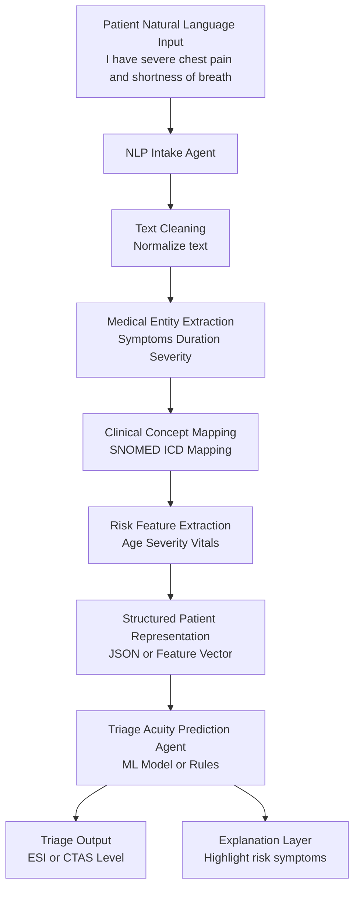

# Approach and Strategy to solving the problem

## What we want?
Need an AI Agent that can take in a natural language version of a patients condition and then structure it for a triage agent to provide a triage acquity

## Creating the Triage agent 

To create the triage agent we experiment with the following approaches
:

1. Basic Uncertainty from Softmax
2. Predictive Entropy
3. Monte Carlo Dropout
4. Deep Ensembles
5. Bayesian Neural Networks
6. Calibration (ECE)
7. Conformal prediction

We will experiment with the following models
1. Ordinal Logistic Regress
2. SVM
3. Random Forest
4. Naive Bayes
5. KNN
6. Decision Trees
7. DNN

To create a model we will be using the following features:
1. PULSE
2. RESPR
3. BPSYS
4. BPDIAS
5. ARREMS
6. INJURY
7. IMMEDR
8. POPCT
9. PAINSCALE
10. RFV1 
11. RACEUN
12. ETHUN
13. SEEN72
 
